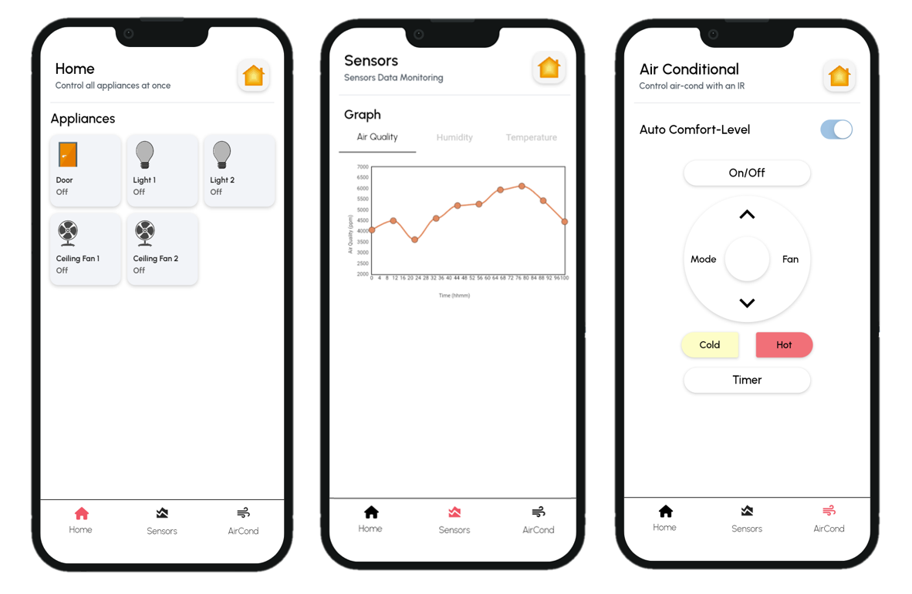

# IOT Smart Home Project
 
## System Architecture
This is a ESP8266-based system

## Circuits & PCB
Schematics, PCBs are designed via [EasyEDA](https://pro.easyeda.com/editor), based on an open-sourced project [this](https://oshwhub.com/zijunchen/esp8266-extension_copy_copy_copy_copy_copy_copy_copy_copy).

The design can be access [here](Altium_NewProject_Schematic_PCB.zip), can be imported into AD or EasyEDA

Prototype

## Code Layout
The code is organized as follows:
- ESP8266/Main/ - Main code (ESP8266, in C)
- ESP8266/ManualTest/ - Testing (ESP8266, in C)
- AndroidApp - Flutter (in Dart)

## Android App
Designed via [FlutterFlow](https://www.flutterflow.io/), the app can be access [here](https://app.flutterflow.io/project/hotel-app-eamssf)  
*Currently in beta, not optimized for TabletView, WebApp yet

It is **recommended** to edit in FlutterFlow directly, as oppose to import into Flutter  
Currently, the database is setup on Supabase, it's recommended to switch to Firebase, for better performance
